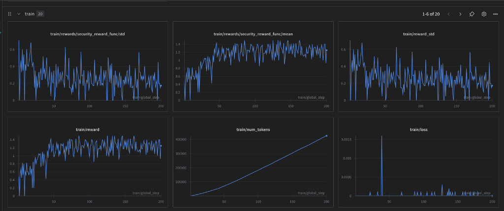
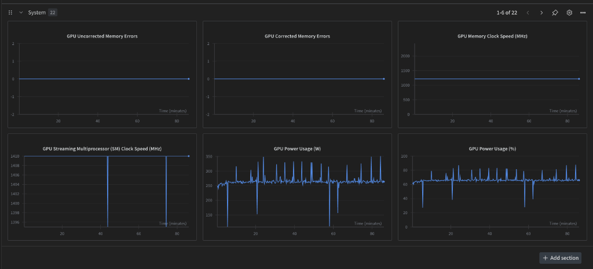

# VulnHunter: Training an AI Security Agent with GRPO

[](https://huggingface.co/gateremark/vulnhunter-agent)
[](https://wandb.ai/gatere-ai/huggingface/runs/v0dge86p)
[](https://rdi.berkeley.edu/agentx-agentbeats)

**TL;DR**: We built VulnHunter, an OpenEnv-compatible reinforcement learning environment for training AI agents to detect and patch web application vulnerabilities. Using Unsloth and GRPO (Group Relative Policy Optimization), we fine-tuned Qwen2.5-Coder-7B to identify SQL injection, XSS, and Path Traversal vulnerabilities—then generate secure patches.

---

## The Problem: AI Can Write Code, But Can It Secure It?

Every company needs secure software. Yet:
- **Static analyzers** produce too many false positives
- **Manual code review** doesn't scale  
- **LLMs** can identify obvious bugs but struggle with multi-step security reasoning

What if we could train an AI agent that doesn't just *identify* vulnerabilities, but *reasons* about them and *generates fixes*?

---

## Solution: VulnHunter

VulnHunter is a reinforcement learning environment where AI agents learn to:

1. **Explore** source code to understand application structure
2. **Identify** vulnerability types (SQL injection, XSS, Path Traversal)
3. **Generate** patches that fix the vulnerability without breaking functionality

### The OpenEnv Environment

We implemented the [OpenEnv standard](https://github.com/meta-pytorch/OpenEnv), which defines a clean interface for RL environments:

```python
# Agent actions in VulnHunter
class Action:
    command: str          # Run security tools (curl, sqlmap)
    read_file: str        # Examine source code
    identify_vuln: dict   # Report vulnerability findings
    patch: dict           # Submit a code fix
```

### The Reward Structure

| Event | Reward | Rationale |
|-------|--------|-----------|
| Identify vulnerability type | +0.3 | Encourage correct classification |
| Generate valid patch | +0.2 | Reward attempting fixes |
| Patch blocks exploit | +1.0 | Main goal achieved |
| Syntax error in patch | -0.2 | Discourage broken code |

The **cumulative max reward of 1.5** means the agent must both identify AND fix to score highly.

---

## Quick Start

### Load the Model
```python
from unsloth import FastLanguageModel

model, tokenizer = FastLanguageModel.from_pretrained(
    "gateremark/vulnhunter-agent"
)

# Analyze vulnerable code
prompt = "Analyze this code: query = f\"SELECT * FROM users WHERE id = {user_id}\""
inputs = tokenizer(prompt, return_tensors="pt")
outputs = model.generate(**inputs, max_new_tokens=256)
print(tokenizer.decode(outputs[0]))
```

### Run the Environment
```bash
git clone https://github.com/gateremark/vulnhunter
cd vulnhunter
uvicorn vulnhunter.env_server.server:app --port 8000
```

### Run the Green Agent
```bash
cd vulnhunter/green_agent
python server.py
# Agent running at http://localhost:9009
```

---

## Why These Technical Choices?

### Why Qwen2.5-Coder-7B?

| Model | Pros | Cons | Our Choice |
|-------|------|------|------------|
| Llama-3-8B | Popular, well-tested | General purpose | ❌ |
| DeepSeek-Coder-7B | Code-specialized | Less Unsloth support | ❌ |
| Qwen2.5-Coder-7B | Code-specialized, Unsloth-optimized | — | ✅ |

**Key reasons:**
1. **Pre-trained on code** — Already understands Python, SQL, security patterns
2. **Instruct variant** — Follows instructions out-of-the-box
3. **7B size** — Sweet spot between capability and training cost
4. **Unsloth support** — 2x faster training with their optimizations

### Why 4-bit Quantization?

```
Full Precision (FP16):  ~14GB VRAM for 7B model
4-bit Quantized:        ~4GB VRAM for 7B model
                         ↓
                    3.5x less memory, same quality!
```

GRPO needs to generate **multiple responses per prompt** (we used 4). 4-bit quantization gave us the headroom to do this efficiently.

### Why GRPO?

| Method | Memory | Complexity | Fit for Our Use Case |
|--------|--------|------------|---------------------|
| **SFT** | Low | Simple | Too passive — doesn't explore |
| **PPO** | High (needs critic) | Complex | Memory-prohibitive |
| **DPO** | Medium | Medium | Needs preference pairs |
| **GRPO** ✅ | Low | Medium | Perfect for reward-based RL |

**GRPO's advantage:** It eliminates the critic model by comparing responses within groups:

1. Generate 4 responses to each prompt
2. Score each with our security reward function
3. Reinforce responses that scored *above the group average*

---

## Training Details

### Setup
- **Hardware:** NVIDIA A100-SXM4-40GB on Lightning.ai
- **Framework:** Unsloth + TRL (GRPOTrainer)
- **Training Time:** ~90 minutes
- **Total Steps:** 200
- **Model:** Qwen2.5-Coder-7B-Instruct (4-bit quantized)

### LoRA Configuration
```python
model = FastLanguageModel.get_peft_model(
    model,
    r=32,                          # Rank
    target_modules=["q_proj", "k_proj", "v_proj", "o_proj", 
                    "gate_proj", "up_proj", "down_proj"],
    lora_alpha=32,
    use_gradient_checkpointing="unsloth",
)
# Only 1.05% of parameters trained!
```

### GRPO Configuration
```python
GRPOConfig(
    learning_rate=2e-5,
    per_device_train_batch_size=1,
    gradient_accumulation_steps=4,
    num_generations=4,              # Group size for GRPO
    max_completion_length=512,
    num_train_epochs=2,
    bf16=True,
)
```

---

## Training Results

We tracked training with Weights & Biases:



**Key observations:**
- Security reward improved from ~0.5 → 1.4
- Loss stabilized near zero
- Consistent training over 200 steps



- GPU Power Usage: 200-350W (active training)
- ~90 minutes total on A100


We tracked training with Weights & Biases:

**Key observations:**
- Security reward improved from ~0.5 → 1.4
- Loss stabilized near zero
- Consistent training over 200 steps
- ~90 minutes total on A100

📊 [View full W&B dashboard](https://wandb.ai/gatere-ai/huggingface/runs/v0dge86p)

---

## Results

After training, VulnHunter accurately identifies and fixes vulnerabilities:

### Test 1: SQL Injection ✅

**Input:**
```python
query = f"SELECT * FROM users WHERE username = '{username}'"
cursor.execute(query)
```

**VulnHunter Output:**
> SQL injection vulnerability detected. Use parameterized queries:
> ```python
> query = "SELECT * FROM users WHERE username = %s"
> cursor.execute(query, (username,))
> ```

### Test 2: XSS ✅

**Input:**
```python
return f"<h1>Results for: {query}</h1>"
```

**VulnHunter Output:**
> Cross-Site Scripting vulnerability. Escape user input:
> ```python
> from html import escape
> return f"<h1>Results for: {escape(query)}</h1>"
> ```

### Test 3: Path Traversal ✅

**Input:**
```python
return send_file(f"/uploads/{filename}")
```

**VulnHunter Output:**
> Path traversal vulnerability. Use safe_join:
> ```python
> from werkzeug.utils import safe_join
> return send_file(safe_join('/uploads', filename))
> ```

---

## Green Agent: A2A Protocol

VulnHunter implements the A2A protocol for interoperability with other agents:

### Agent Discovery
```json
GET /.well-known/agent.json

{
  "name": "VulnHunter",
  "description": "AI security agent that detects and fixes web vulnerabilities",
  "skills": [{"id": "analyze_code", "name": "Analyze Code"}]
}
```

### Send Task
```python
import requests

response = requests.post("http://localhost:9009/agent/task", json={
    "type": "analyze",
    "code": "query = f\"SELECT * FROM users WHERE id = {user_id}\""
})
print(response.json())
```

---

## Project Structure

```
vulnhunter/
├── vulnhunter/
│   ├── env_server/          # OpenEnv server
│   │   ├── server.py        # FastAPI endpoints
│   │   └── models.py        # Pydantic models
│   └── green_agent/         # A2A Agent wrapper
│       ├── agent.py         # Core agent logic
│       ├── server.py        # A2A HTTP server
│       └── Dockerfile       # Container support
├── train_simple.py          # GRPO training script
├── train_grpo.py            # Full training with environment
├── test_vulnhunter.py       # Model testing script
└── requirements.txt
```

---

## Links

| Resource | Link |
|----------|------|
| **Model** | [huggingface.co/gateremark/vulnhunter-agent](https://huggingface.co/gateremark/vulnhunter-agent) |
| **Model (W&B)** | [huggingface.co/gateremark/vulnhunter-agent-wandb](https://huggingface.co/gateremark/vulnhunter-agent-wandb) |
| **W&B Run** | [wandb.ai/gatere-ai/huggingface/runs/v0dge86p](https://wandb.ai/gatere-ai/huggingface/runs/v0dge86p) |
| **OpenEnv** | [github.com/meta-pytorch/OpenEnv](https://github.com/meta-pytorch/OpenEnv) |

---

## Acknowledgments

Built for the **AgentBeats OpenEnv Challenge** sponsored by:
- **PyTorch** (Meta)
- **Hugging Face**
- **Unsloth**

---

*Built with ❤️ by [gateremark](https://github.com/gateremark)*
